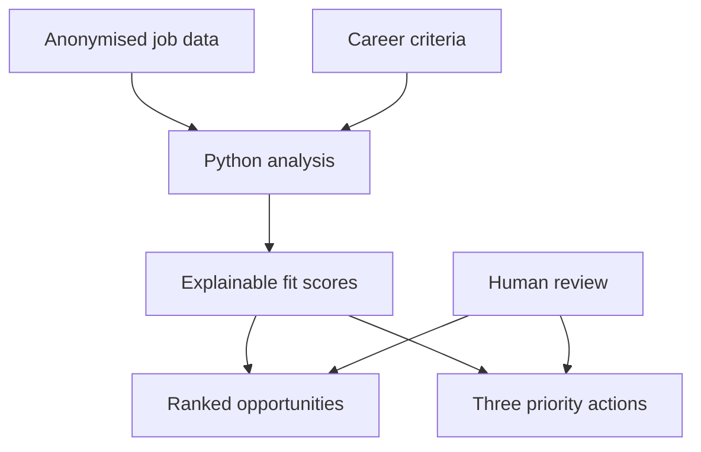

# Career Strategy Automation

[](https://github.com/cgcatalao-sketch/career-strategy-automation/actions/workflows/analyse.yml)

An AI-assisted, human-reviewed workflow that transforms job-market data into structured insights, prioritised opportunities and traceable next actions.

## Why this project exists

Career research often produces scattered links, repeated manual comparisons and decisions that are difficult to revisit. This project demonstrates a transparent workflow for organising opportunity data, applying consistent criteria and generating decision-ready outputs.

It is based on a broader career-research initiative involving a 40-vacancy market sample, keyword mapping, evidence tracking, a five-part analytical workbook and documented Jira tasks. This public repository uses fictional sample data so the workflow can be demonstrated without exposing personal or confidential information.

## What the automation does

1. Reads anonymised job records from a CSV file.
2. Reads target roles, priority keywords and preferences from a JSON configuration.
3. Calculates an explainable fit score for every opportunity.
4. Records the evidence behind each score.
5. Ranks the opportunities consistently.
6. Generates a CSV ranking and a Markdown summary with three priority actions.
7. Runs tests and the analysis automatically through GitHub Actions.

## Workflow



## Repository structure

```text
career-strategy-automation/
├── .github/workflows/analyse.yml  # Continuous automated checks
├── config/profile.json            # Roles, keywords, preferences and weights
├── data/sample_jobs.csv           # Fictional demonstration data
├── docs/methodology.md             # Logic, limitations and privacy approach
├── src/analyze_jobs.py             # Analysis and output generation
└── tests/test_analyze_jobs.py      # Automated behaviour checks
```

## Run it locally

Python 3.11 or newer is recommended. The project uses only the Python standard library, so no third-party packages are required.

```bash
python -m unittest discover -s tests -v
python src/analyze_jobs.py
```

The analysis creates:

- `outputs/ranked_jobs.csv`: ranked opportunities with scores and evidence;
- `outputs/priority_actions.md`: three suggested review actions.

## Example scoring model

| Criterion | Weight |
|---|---:|
| Target-role match | 35% |
| Priority-keyword coverage | 45% |
| Preferred work mode | 15% |
| Preferred region | 5% |

The criteria are intentionally stored outside the code. This separates strategic decisions from technical implementation and makes the workflow easier to update.

## My role

I defined the business problem, scope, decision criteria and required outputs; structured the workflow; used AI to support research and implementation; reviewed the logic and evidence; and documented the process for handover and reuse.

The project reflects how I approach executive and operational support: turn dispersed information into clear priorities, keep decisions traceable, use automation where it adds value and retain human judgement where context matters.

## Responsible use and limitations

This is a prioritisation aid, not an automated hiring predictor. A high score does not guarantee suitability or hiring success. Human review remains necessary for requirements, eligibility, organisational context and application evidence. The public dataset is fictional and contains no personal applicant information.

See [the methodology](docs/methodology.md) for the complete scoring logic and limitations.

## Licence

This project is available under the [MIT License](LICENSE).
