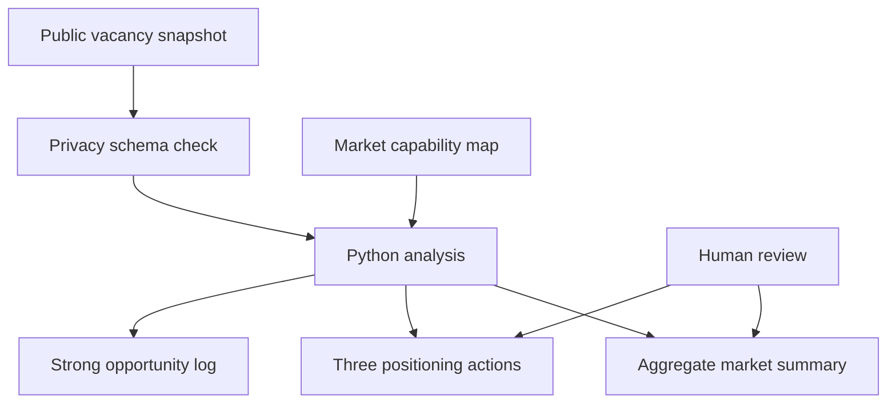

# Career Strategy Automation

[](https://github.com/cgcatalao-sketch/career-strategy-automation/actions/workflows/analyse.yml)

An AI-assisted, human-reviewed workflow that transforms a real, privacy-safe vacancy snapshot into structured market intelligence and traceable positioning actions.

## Why this project exists

Career research often produces scattered links, repeated manual comparisons and decisions that are difficult to revisit. This project demonstrates a transparent workflow for organising opportunity data, extracting market signals and keeping a living record of strong opportunities discovered by continuing monitoring.

It is based on a real career-research initiative involving a 40-vacancy market sample, keyword mapping, evidence tracking, a five-part analytical workbook and documented Jira tasks. The public snapshot retains only vacancy attributes from public listings; personal assessments and application history remain private.

## What the automation does

1. Reads 40 sanitised records based on real public vacancies collected on 23 August 2026.
2. Enforces a strict seven-column public-data schema.
3. Calculates role-family and work-model distributions.
4. Measures the frequency of 15 recurring market capabilities.
5. Generates a CSV market summary and three evidence-based positioning actions.
6. Records strong new opportunities generated by continued monitoring.
7. Runs privacy tests and the analysis automatically through GitHub Actions.

## Workflow



## Repository structure

```text
career-strategy-automation/
├── .github/workflows/analyse.yml  # Continuous automated checks
├── config/market_capabilities.json # Fifteen capability definitions
├── data/public_vacancy_snapshot.csv # Sanitised real public-vacancy snapshot
├── data/public_keyword_evidence.csv # Binary evidence linked only by record ID
├── data/discovered_opportunities.csv # Strong outcomes from continued monitoring
├── docs/methodology.md             # Logic, limitations and privacy approach
├── src/analyze_market.py           # Aggregate analysis and output generation
└── tests/test_analyze_market.py    # Analysis and privacy-schema checks
```

## Run it locally

Python 3.11 or newer is recommended. The project uses only the Python standard library, so no third-party packages are required.

```bash
python -m unittest discover -s tests -v
python src/analyze_market.py
```

The analysis creates:

- `outputs/market_summary.csv`: aggregate counts and sample shares;
- `outputs/positioning_actions.md`: three evidence-based positioning actions.
- `outputs/discovery_log.md`: public evidence of strong opportunities found by the workflow.

## Real-world case study

| Research element | Public evidence |
|---|---:|
| Vacancies analysed | 40 |
| Remote or remote-first roles | 31 |
| Role families | 3 |
| Market capabilities tracked | 15 |

### Validated workflow outcome

The continuing monitoring process identified the [ElevenLabs Executive Assistant vacancy](https://elevenlabs.io/careers/aa387988-9983-46a0-a265-d678af9939cb/executive-assistant) as a strong opportunity. The role explicitly values executive support, cross-time-zone coordination, action follow-through, discretion, AI fluency and automation — capabilities surfaced by this project. This is recorded as an outcome of the workflow, while all private application materials and status remain outside the repository.

The capability definitions are stored outside the code. This separates analytical decisions from technical implementation and makes the workflow easier to audit and update.

## My role

I defined the business problem, scope, decision criteria and required outputs; structured the workflow; used AI to support research and implementation; reviewed the logic and evidence; and documented the process for handover and reuse.

The project reflects how I approach executive and operational support: turn dispersed information into clear priorities, keep decisions traceable, use automation where it adds value and retain human judgement where context matters.

## Responsible use and limitations

This is a market-intelligence case study, not an automated hiring predictor. Human review remains necessary for requirements, eligibility, organisational context and application evidence. The public snapshot contains no personal fit scores, application decisions, recruiter interactions, contact details or private notes. The code rejects unexpected data columns before analysis.

See [the methodology](docs/methodology.md) for the complete scoring logic and limitations.

## Licence

This project is available under the [MIT License](LICENSE).
